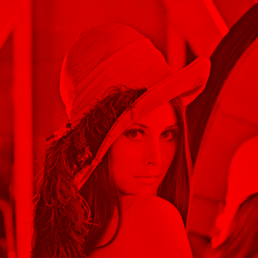
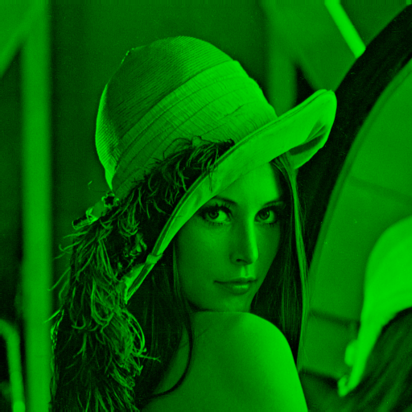
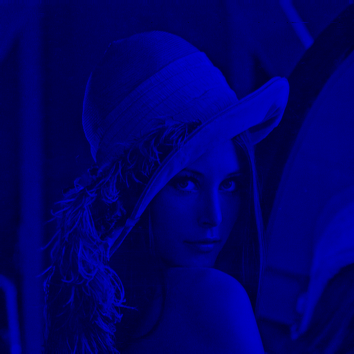
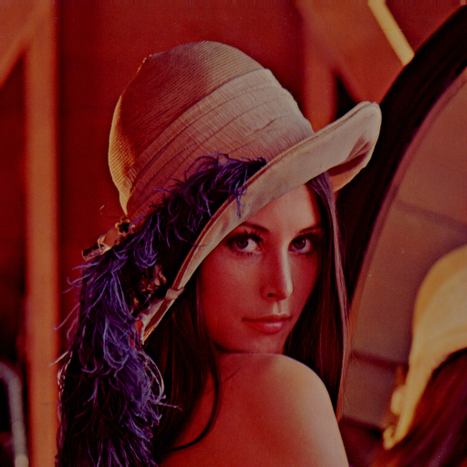
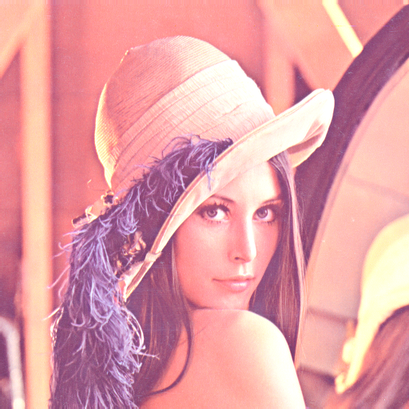
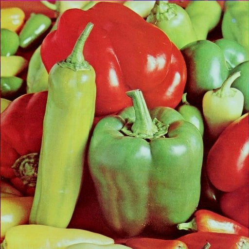
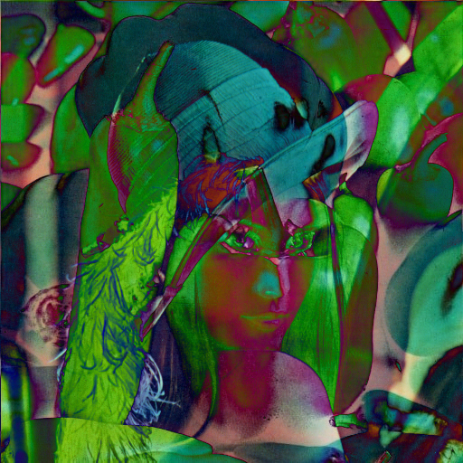

<h1>The Original Image:</h1> 

 
<h2><b>Grayscale filter<b>:</h2>

  Average Method            |  Weighted method
:-------------------------:|:-------------------------:
  |  
 X(img_data) = (R+G+B)/3 | X(img_data) = 0.3R+0.59G+0.11B
  
<h2><b>Color Filters:</b></h2>

  RED            |  GREEN     |     BLUE
:-------------------------:|:-------------------------:|:---------------------:
  |    |  

  

<h2><b>Brightness Control:</b></h2>

  Decrease           |  Increase
:-------------------------:|:-------------------------:
  |  

 

<h2><b>Difference Map:</b></h2>

  Source Image           |  Difference
:-------------------------:|:-------------------------:
  |  

 