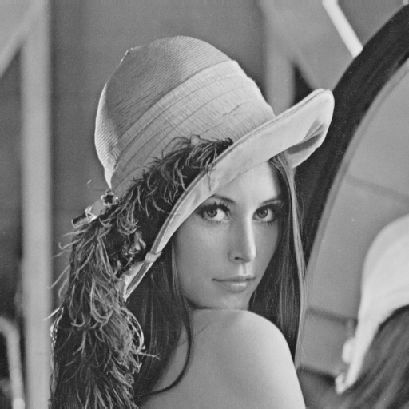

The Original Image: 

 
<b>Grayscale filter<b>: 
  Average Method            |  Weighted method
:-------------------------:|:-------------------------:
  |  
 X(img_data) = (R+G+B)/3 | X(img_data) = 0.3R+0.59G+0.11B
  

  Average Method            |  Weighted method
:-------------------------:|:-------------------------:
  |  
 X(img_data) = (R+G+B)/3 | X(img_data) = 0.3R+0.59G+0.11B
  
